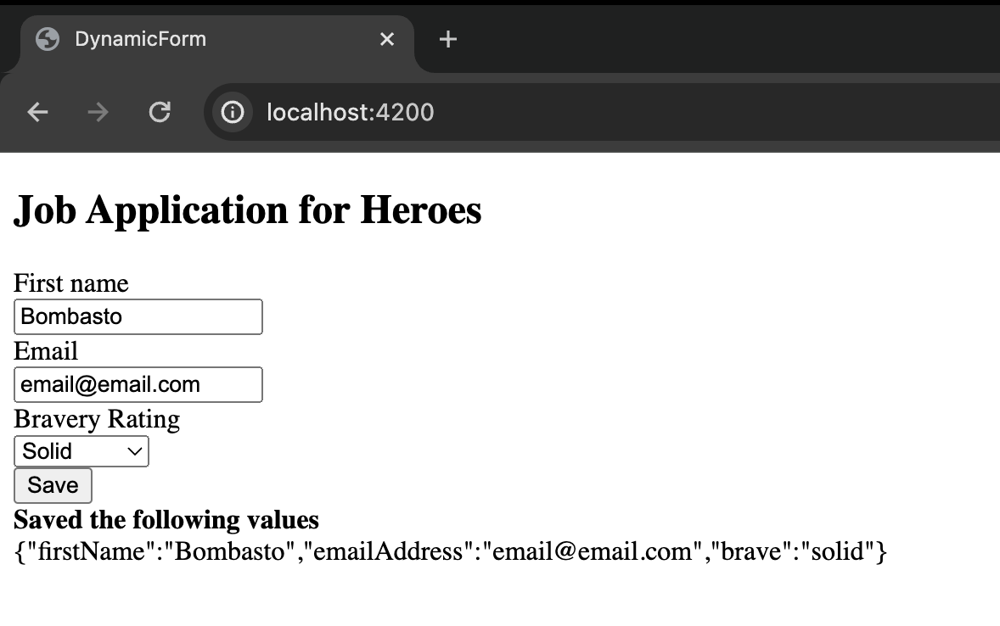

# forms-angular-pond-s4m9
Atividade de desenvolvimento de formulário dinâmico com Angular.
## 1. Tecnologia e conceitos aprendidos

### 1.1 Conceitos aprendidos  
#### O que são formulários dinâmicos
- Formulários dinâmicos são muito úteis em situações em que gostaríamos de reutilizar o template de um formulário, mas para diferentes contextos, mas com um conteúdo diferente.
- O esqueleto do formulário deve permanecer o mesmo, mas as perguntas podem mudar, sem que o código precise.
- os campos de perguntas podem ser personalizados, e adicionados ou removidos de forma dinâmica

#### SPAs
- O angular é um framework de javascropt, e um SPA (single-page app), ou seja, possui beneficios como:
  - estruturas simples
  - navegação fácil
  - processamento de dados mais eficiente
  - menor custo comparado a sites tracicionais (MPA)
  - reutilização de layouts → menos tempo de desenvolvimento
  - melhor UX e responsividade
  - melhor performance
  - melhor debug com o chrome

### 1.2 Tecnologias utilizadas
- Angular
- TypeScript
- HTML5
#### Formulários dinâmicos com Angular
- no exemplo desenvolvido:
  - os dados foram passados de forma mockada, mas esse template poderia estar integrado a um backend que envia dados de um db;
  - possui uma validação simples de obrigatoriedade dos campos para enviar o formulário, mas poderíamos ir além no quesito validação dos campos (criar diferentes regras), pois o Angular oferece grande suporte.
  - o forms criado simula um formulário de inscrição para um emprego, voltado para super herois. nele contém os campos: first name, email, bravery hanking e um botão para salvar as informações, que retorna-as em formato json na tela:
  - 
#### Projeto com Angular
- Passo-a-passo:

1.     atualizar npm e instalar Angular CLI
2.     criar app: npx ng new forms-angular-app
3.       rodar app: npx ng serve

